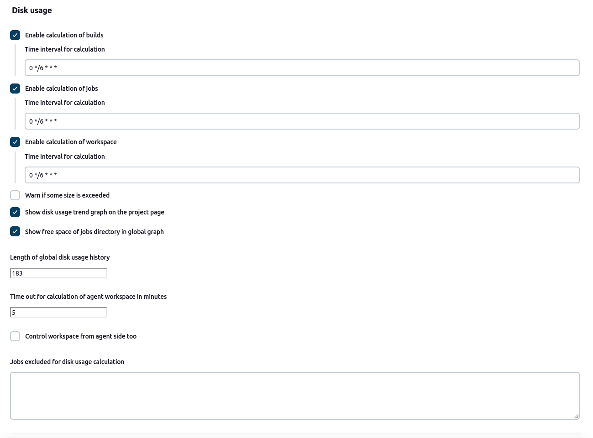

Disk Usage Plugin
=========================

This plugin records disk usage.

# Configuration

Showing disk usage trend graph is optional - unselect the `Show disk usage trend graph` checkbox on the global configuration page (`Manage Jenkins` -> `System configuration`) if you don't want to see the graph on the project page.

# Usage

When you install this plugin, disk usage is calculated every 6 hours. You can see project list with occupied disk space by going to the "Disk Usage" page in the management section (`Manage Jenkins` -> `Disk Usage`). The same page also allows you to schedule disk usage calculation immediately.
  

More detailed information can be seen on the project page, where you can find disk usage for each build and workspace, as well as a graph with disk usage trend.
  

You can configure the plugin in `Manage Jenkins` -> `Configure System`

