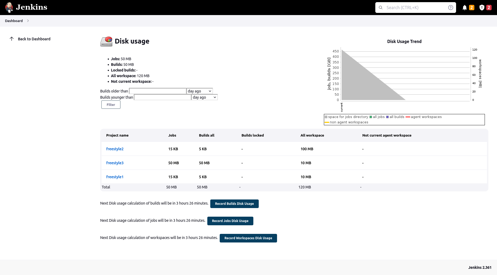
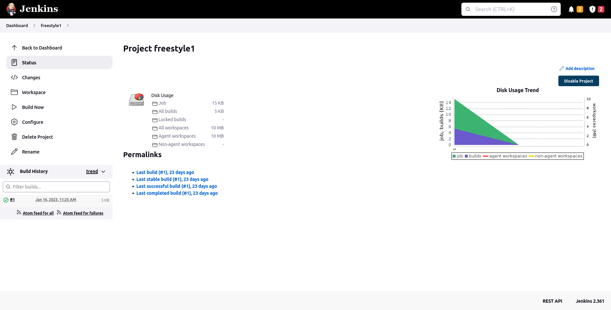

This plugin records disk usage.

# Configuration

Showing disk usage trend graph is optional - unselect the "Show disk
usage trend graph" checkbox on the global configuration page ("Manage
Jenkins" -\> "System configuration") if you don't want to see the graph
on the project page.

# Usage

When you install this plugin, disk usage is calculated each 60 minutes.
You can see project list with occupied disk space by going to the "Disk
Usage" page in the management section (Dashboard -\> "Manage Jenkins"
-\> "Disk Usage"). The same page also allows you to schedule disk usage
calculation immediately.

  

More detailed information can be seen on the project page, where you can
find disk usage for each build and workspace, as well as a graph with
disk usage trend.

  

# Change Log

### Upcoming changes

### Release 0.29 (Coming soon)

-   Add support of Disk usage stats for ItemGroups like Folders
    ([commit/6bb9c07a051daba18d6975212416eca48ed48743](https://github.com/jenkinsci/disk-usage-plugin/commit/6bb9c07a051daba18d6975212416eca48ed48743))
-   Add disk usage checks of unloaded jobs and builds
    ([commit/1c34d56d1508f6c29f8881b7bdc51c194fc96cab](https://github.com/jenkinsci/disk-usage-plugin/commit/1c34d56d1508f6c29f8881b7bdc51c194fc96cab))
-   Remove thread sleep during check rescheduling after changing CronTab
    settings blocks "configSubmit"
    ([JENKINS-30934](https://issues.jenkins-ci.org/browse/JENKINS-30934))
-   Fixed alignment of project graph
    ([JENKINS-30586](https://issues.jenkins-ci.org/browse/JENKINS-30586))
-   Fix image URLs ([PR
    \#34](https://github.com/jenkinsci/disk-usage-plugin/pull/34))

### Release 0.28 (Oct 01, 2015)

-   Remove excessive logging (JENKINS-30718)

### Release 0.27 (September 21 2015)

-   Require admin permission to calculate disk space (JENKINS-23100)
-   Add disk usage as post-build step 

### Release 0.26 (September 14 2015)

-   Fix bug where saving configuration resulted in multiple Job Config
    History entries (JENKINS-22224)
-    

### Release 0.25 (January 26, 2015)

-   Plugin doesn't rely on the format of `Run.id` any more ([pull
    \#26](https://github.com/jenkinsci/disk-usage-plugin/pull/26))

### Release 0.24 (August 5, 2014)

Partially based on Git commit messages, it is difficult to pair them
with Jira tasks.

-   Update disk usage changelog
    ([JENKINS-20604](https://issues.jenkins-ci.org/browse/JENKINS-20604))
-   Add workspace information in plugin main page
-   Separate not current slave wokrspace
-   Add current state into overall graph
-   Separate scale for workspaces
-   Enable excluded jobs for disk usage calculation
-   Fix size style on job page
-   Fix typo + move methods getValue and getUnit into
    ProjectDiskUsageActionFactory class

### Release 0.23 (November 12, 2013)

Based on Git commit messages, it is difficult to pair them with Jira
tasks.

-   Add test + fix bug which they catch and better line for graphAdd
    test + fix bug which they catch and better line for graph
-   Reverse build order in graph
-   Make graph huger
-   Make free space in job directory optional in global graph
-   Better sheduling automatic calculation
-   Move information about project disk usage form config.xml of job
-   Fixing typo direcotory -\> directory
-   Display next execution time and add buttom for builds, jobs and
    workspaces
-   Fix link in menu on main page

### Release 0.22 (October 18, 2013)

Based on Git commit messages, it is difficult to pair them with Jira
tasks.

-   Fix tests - HudsonTestCase perform tests in the same jenkins home
    directory, so test have to do clean up
-   Fix test
-   Display all workspaces
-   Save history
-   Fix backward compatibility, fix concurent modification exception and
    make timeout workspace configurable
-   Replace Util.isSymlink
-   Fix backward compatibility
-   Control if diskUsageWithoutBuild!=null
-   Check if slaveWorkspacesUsage is not null
-   Change developer
-   Better colors for graph
-   Add backward compatibility
-   Add tests and fix bug which test find out
-   Correct information about author
-   Add tests for case the slave is deleted or workspace of project was
    deleted
-   Fix problems with claculation threads and removing workspaces form
    diskUsage set if do not exist or its slave does not exists
-   Add tests
-   Fix problems with symlinks
-   Add filter for builds age
-   Fix issue with graph
-   Add e-mail warnings
-   Configurable disk usage calculation
-   Another type of graph
-   Rewrite creation of graphs
-   Add funkcionality for counting disku usage of workspaces + tests
-   Change behaviour for counting jobs size and builds size + add tests
    for it
-   Rewriting disk-usage classes structure

### Release 0.21 (September 9, 2013)

-   Added option for workspace calculation timeout configuration ([pull
    \#14](https://github.com/jenkinsci/disk-usage-plugin/pull/14))
-   Added French translation ([pull
    \#13](https://github.com/jenkinsci/disk-usage-plugin/pull/13))
-   Don't follow symlinks ([pull
    \#12](https://github.com/jenkinsci/disk-usage-plugin/pull/12))

### Release 0.20 (June 5, 2013)

-   If workspace doesn't exists, use zero size instead of using previous
    workspace ([pull
    \#11](https://github.com/jenkinsci/disk-usage-plugin/pull/11))
-   Traditional Chinese translations ([pull
    \#10](https://github.com/jenkinsci/disk-usage-plugin/pull/10))

### Release 0.19 (March 15, 2013)

-   Fixed link Jenkins management section
    ([JENKINS-16420](https://issues.jenkins-ci.org/browse/JENKINS-16420))
-   Fixed root link to preserve protocol
    ([JENKINS-15565](https://issues.jenkins-ci.org/browse/JENKINS-15565))
-   Fixed Compute maven module disk usage
    ([JENKINS-15534](https://issues.jenkins-ci.org/browse/JENKINS-15534))
-   Setup workspace timeout and added calculation of the build
    immediately after the build ([pull
    \#9](https://github.com/jenkinsci/disk-usage-plugin/pull/9))

### Release 0.18 (September 4, 2012)

-   Fixed DiskUsage dont show values
    ([JENKINS-14248](https://issues.jenkins-ci.org/browse/JENKINS-14248))
-   Overall disk usage graph, removed some deprecated methods ([pull
    \#8](https://github.com/jenkinsci/disk-usage-plugin/pull/8)) 

### Release 0.17 (May 24, 2012)

-   Added support for hierachical job model ([pull
    \#6](https://github.com/jenkinsci/disk-usage-plugin/pull/6))
-   Fixed broken showGraph ([pull
    \#7](https://github.com/jenkinsci/disk-usage-plugin/pull/7)) 

### Release 0.16 (April 13, 2012)

-   Fixed wrong URL in LHS menu
    ([JENKINS-12917](https://issues.jenkins-ci.org/browse/JENKINS-12917))
-   Fixed possible NPE during Jenkins startup
    ([JENKINS-12970](https://issues.jenkins-ci.org/browse/JENKINS-12970))

### Release 0.15 (February 26, 2012)

-   Migration from job property to project action which fixed couple of
    things
    ([JENKINS-12870](https://issues.jenkins-ci.org/browse/JENKINS-12870))
-   Link to disk usage plugin added to main page as /manage is
    restricted only for users with admin rights

### Release 0.14 (June 27, 2011)

-   Fixed NPE
    ([JENKINS-8844](https://issues.jenkins-ci.org/browse/JENKINS-8844))

### Release 0.13 (March 26, 2011)

-   Japanese translation 

### Release 0.12 (Oct 22, 2010)

-   Bug fix - workspace disk usage shows wrong values in some cases
    ([JENKINS-7867](https://issues.jenkins-ci.org/browse/JENKINS-7867))

### Release 0.11 (Jun 4, 2010)

-   Sort functionality
    ([JENKINS-3531](https://issues.jenkins-ci.org/browse/JENKINS-3531))
-   Update Build only if disk usage changed
    ([JENKINS-5731](https://issues.jenkins-ci.org/browse/JENKINS-5731))
-   Check also workspace for changes
-   Calculation interval changed to 6 hours
-   Values of sums moved to bottom of table
    ([JENKINS-5749](https://issues.jenkins-ci.org/browse/JENKINS-5749))
-   Some typos
    ([JENKINS-4691](https://issues.jenkins-ci.org/browse/JENKINS-4691),[JENKINS-5748](https://issues.jenkins-ci.org/browse/JENKINS-5748))

### Release 0.10 (Feb 10, 2010)

-   Update code for more recent Hudson

### Release 0.9 (May 28, 2009)

-   Fixed a problem where prolonged disk usage computation can starve
    other timer activities, like polling.

### Release 0.8:

-   Now works with Hudson ver. 1.293 (for details see
    [JENKINS-3340](https://issues.jenkins-ci.org/browse/JENKINS-3340))

### Release 0.7:

-   ?

### Release 0.6:

-   Added sum of values on the top of the overview page.
-   Disk usage for build is recalculated each time to reflect artifacts
    deletion.
-   Default trigger interval prolonged to 60 minutes.

### Release 0.5:

-   Fixed "Back to Dashboard" link.
-   Added option for showing trend graph.
-   Fixed and reversed ordering on the overview page (the most space
    consuming projects are on the top of the page now).

### Release 0.4:

-   Fixed NPE.

### Release 0.3:

-   Icon changed.

### Release 0.2:

-   First available public release.

# Missing features and known bugs

-   The trigger interval should be configurable
    [JENKINS-13246](https://issues.jenkins-ci.org/browse/JENKINS-13246),
    [JENKINS-10116](https://issues.jenkins-ci.org/browse/JENKINS-10116)
-   The disk-usage of the whole job should be shown too, because it's a
    very important value.
-   [All open
    issues](https://issues.jenkins-ci.org/secure/IssueNavigator.jspa?reset=true&jqlQuery=project+%3D+JENKINS+AND+component+%3D+disk-usage+AND+resolution+%3D+Unresolved+ORDER+BY+priority+DESC%2C+key+DESC&mode=hide)
